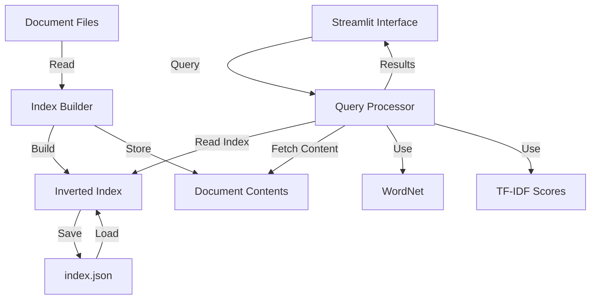

# Document Retrieval System Architecture

## Components

### User Interface
- **Streamlit Interface**: Web-based search interface

### Core System
- **Index Builder**: Processes documents and creates index
- **Query Processor**: Handles search queries
- **Inverted Index**: Maps terms to documents
- **Document Contents**: Stores processed documents

### Storage
- **Document Files**: Raw document corpus
- **index.json**: Persistent index storage

### Features
- **WordNet**: Synonym expansion
- **TF-IDF**: Term importance scoring